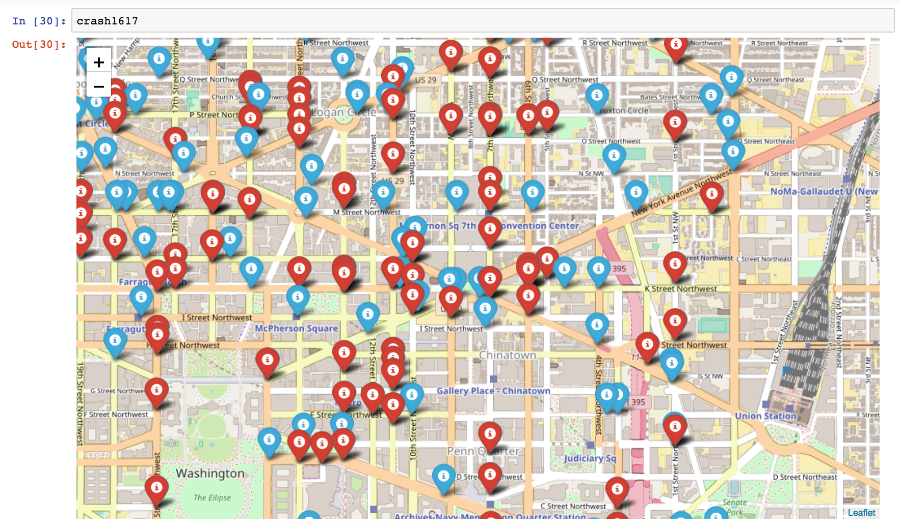

# DC Bicycle Crash Analysis

What happens when a data scientist buys a bike?

He/she uses open data to identify safest routes.

This will be sporadic analysis.

Open data in DC is awesome. [data source](http://opendata.dc.gov/datasets/70248b73c20f46b0a5ee895fc91d6222_25/data)

Enjoy.

